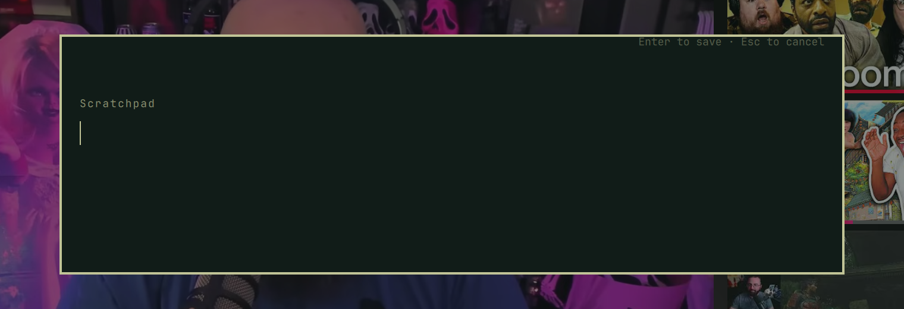
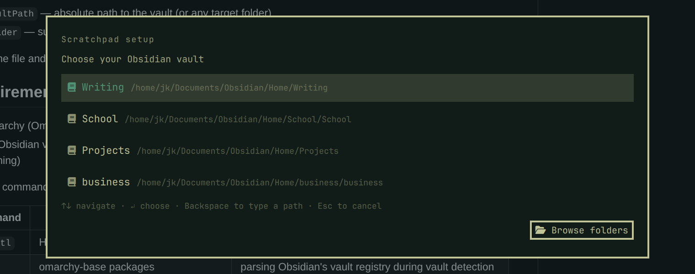
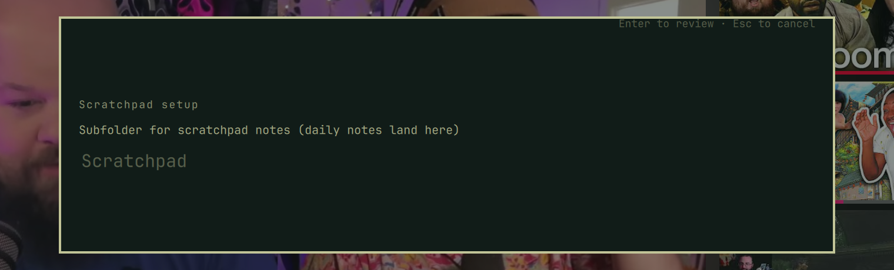
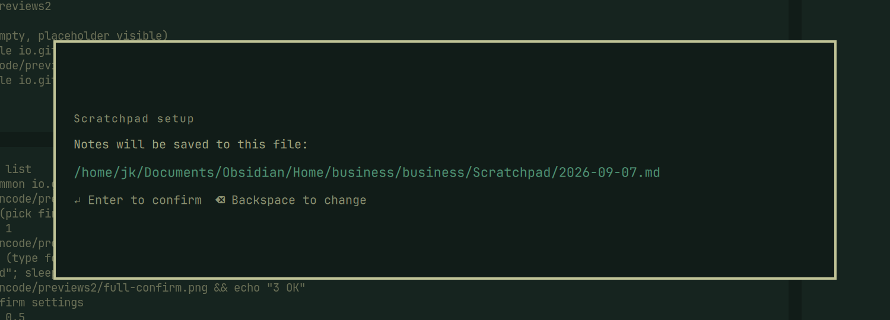

# Scratchpad for Obsidian

A quick-capture scratchpad plugin for the [Omarchy](https://omarchy.org) shell
that sends notes straight into your Obsidian vault.

Press a keybinding (or click the bar icon), type a note, hit Enter — the note
lands as a timestamped bullet in a daily markdown file inside your Obsidian
vault. Obsidian picks it up instantly; no sync plugin or REST API needed.



## Screenshots

| Setup wizard — vault detection | Setup wizard — subfolder | Setup wizard — confirmation |
|---|---|---|
|  |  |  |

## Features

- **Fast capture** — SUPER+N opens a themed text box that matches your Omarchy
  theme; Enter saves, Esc cancels
- **Daily notes** — notes append as `- HH:MM — text` bullets to
  `<vault>/<folder>/YYYY-MM-DD.md`; the `# YYYY-MM-DD` heading is created
  automatically on the first note of the day
- **Bar widget** — pencil icon in the bar: left-click toggles the capture box,
  right-click reopens setup
- **Setup wizard** — first run walks you through choosing a vault and
  subfolder, with a confirmation screen showing the exact save path
- **Vault detection** — lists your registered Obsidian vaults automatically
  (from `~/.config/obsidian/obsidian.json`) plus a filesystem scan for
  `.obsidian` folders; native folder-picker dialog and manual path entry as
  fallbacks
- **Self-sizing UI** — the capture box grows with your text; the vault list
  grows with the number of vaults
- **Error recovery** — a failed write reopens the setup wizard instead of
  leaving you stuck

## Install

```
omarchy plugin add https://github.com/DuBearte/omarchy-scratchpad.git --enable
```

Then add the keybinding in `~/.config/hypr/bindings.lua`:

```lua
o.bind("SUPER + N", "Scratchpad", "omarchy-shell shell toggle io.github.dubearte.scratchpad")
```

## Usage

| Action | How |
|---|---|
| Capture a note | SUPER+N, type, Enter |
| Cancel | Esc or click outside |
| Reconfigure (vault/folder) | Right-click the bar pencil icon |
| Capture from the bar | Left-click the bar pencil icon |

## Configuration

Settings live in `~/.config/omarchy/scratchpad/settings.json`:

```json
{
  "vaultPath": "/home/you/Documents/Obsidian/MyVault",
  "folder": "Scratchpad"
}
```

- `vaultPath` — absolute path to the vault (or any target folder)
- `folder` — subfolder inside the vault where daily notes are written

Delete the file and use the bar icon's right-click (or SUPER+N) to re-run the
setup wizard.

## Requirements

- Omarchy (Omarchy shell with plugin support)
- An Obsidian vault anywhere on disk (the plugin only writes markdown files —
  Obsidian itself doesn't need to be running)

External commands and runtimes the plugin invokes (all ship with a stock
Omarchy install, so there is nothing extra to install):

| Command | Provided by | Used for |
|---|---|---|
| `hyprctl` | Hyprland | floating/centering the folder-picker window during setup |
| `jq` | omarchy-base packages | parsing Obsidian's vault registry during vault detection |
| `qml6` | Qt6 (a Quickshell runtime dependency) | the optional native folder-picker dialog |
| `python3` | python (a hard dependency of Omarchy's `uwsm` session manager) | `scripts/note-writer.py`, the writer that saves notes and settings |

## Notes

- Notes are plain filesystem appends; if you use Syncthing or another sync
  tool on your vault, make sure its index is healthy — a corrupted sync index
  can interfere with externally-created files
- Settings live outside the plugin folder so saving them doesn't trigger a
  plugin hot-reload
- All file writes go through a descriptor-based helper
  (`scripts/note-writer.py`) that resolves the target directory without
  following symlinks, opens the target file with `O_NOFOLLOW`, verifies it is
  a regular file, and writes through that descriptor. If the vault folder,
  daily note, or settings file is (or becomes) a symlink, the write fails
  closed with a notification instead of following it.

## Updating

```
omarchy plugin update io.github.dubearte.scratchpad
```

Updates are diff-previewed and require confirmation; local modifications are
never overwritten silently.

## Uninstalling

```
omarchy plugin remove io.github.dubearte.scratchpad
```

This deletes the plugin folder, unloads it from the shell, and removes its
entries from `shell.json`.

Two things are left behind (both harmless, both your call):

- **Keybinding** — the SUPER+N binding lives in
  `~/.config/hypr/bindings.lua`, which the plugin system never touches. To
  remove it, delete this line:

  ```lua
  o.bind("SUPER + N", "Scratchpad", "omarchy-shell shell toggle io.github.dubearte.scratchpad")
  ```

- **Saved settings** — `~/.config/omarchy/scratchpad/settings.json` (your
  vault and folder choice). Delete the file (or the `scratchpad` directory)
  if you don't want it remembered on a future reinstall.

Notes already written into your vault are regular markdown files — removing
the plugin never touches them.